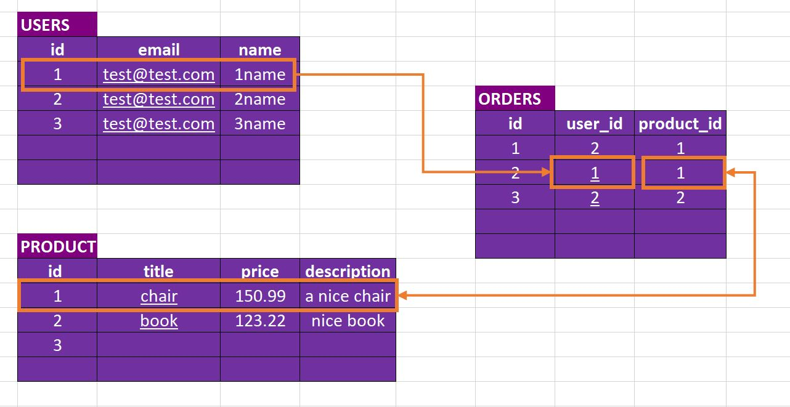

# SQL

*  SQL used to store data, before we used to store data on variables this would make our application slower, for that we use a database which is a specific program that allow us to Create Read Update and Delete.

# using SQL in a Node.js APP
* **why we using database again** to store data and make it easily accessible
* what is SQL?
  - SQL database thinks as a tables.

  

* Core SQL Database Characterstics are:
  - we have a strong Data Schema. so taht for each table we clearly define- how did data in there should look like which field should we have, which type of data (number,boolean,text) we store. 
  - Data Relation: we relate our different tables with three important king of relation
    - one-to-one
    - one-to many
    - many-to-many

* SQL dtand for structured Query Languge.
  - in SQL queries look something like **SELECT * FROM users WHERE age > 28;**

  

| Horizontal Scaling | Vertical Scaling |
|-----------------|:-------------|
| * Add more servers(and merge data into Databsse)| * in this we make our exsistaing server stoger by adding more memory  | 
| * we can do it infinitely (buy servers store data cloud)  |    * there are limitation of a single server capability       | 
|      |        |
||

  * in SQL 
   - data uses Schemas
   - relations
   - data distributed across multiple tables.
   - Horizontal scaling is difficult/impossible; Vertical scaling is possible

